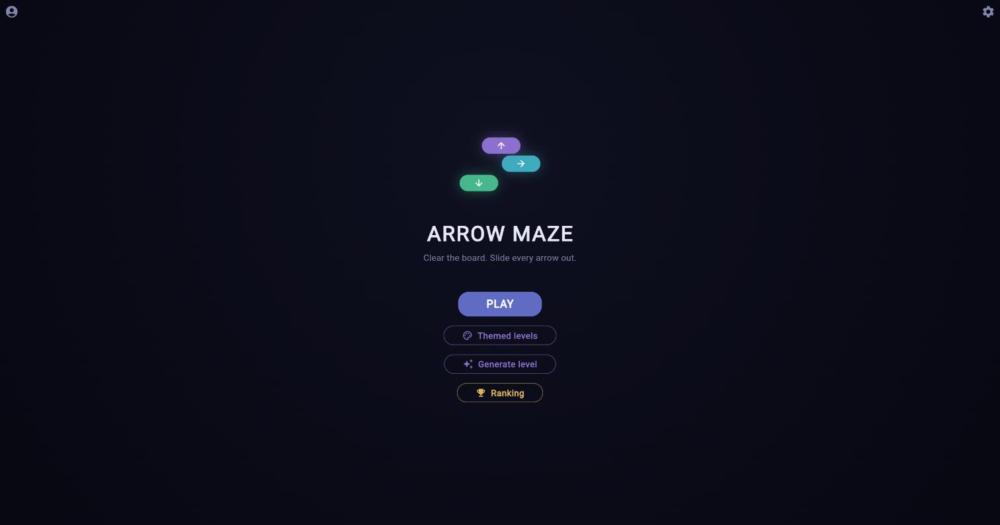
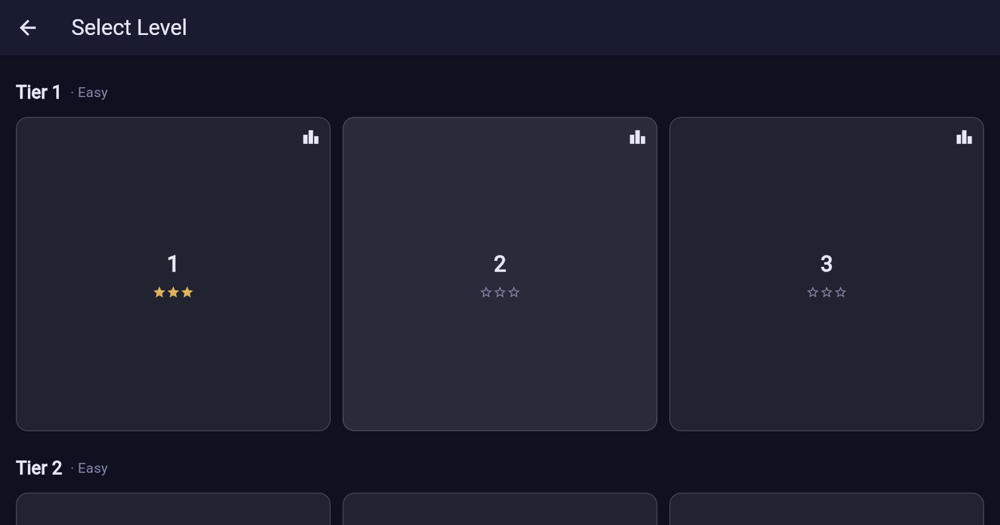
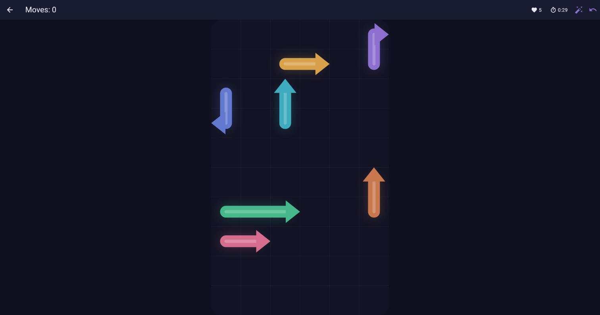
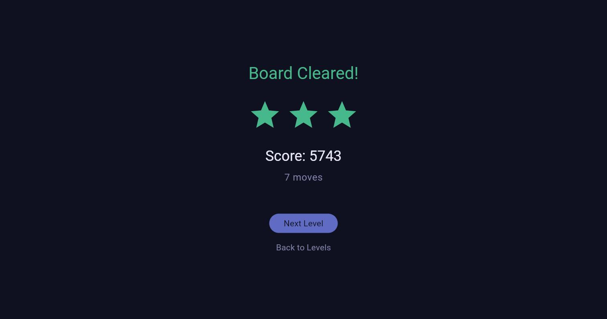
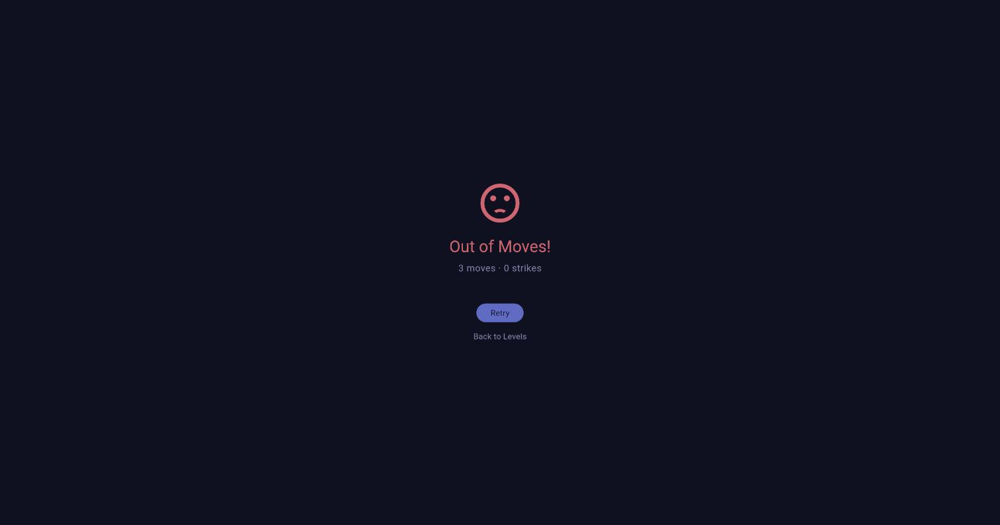
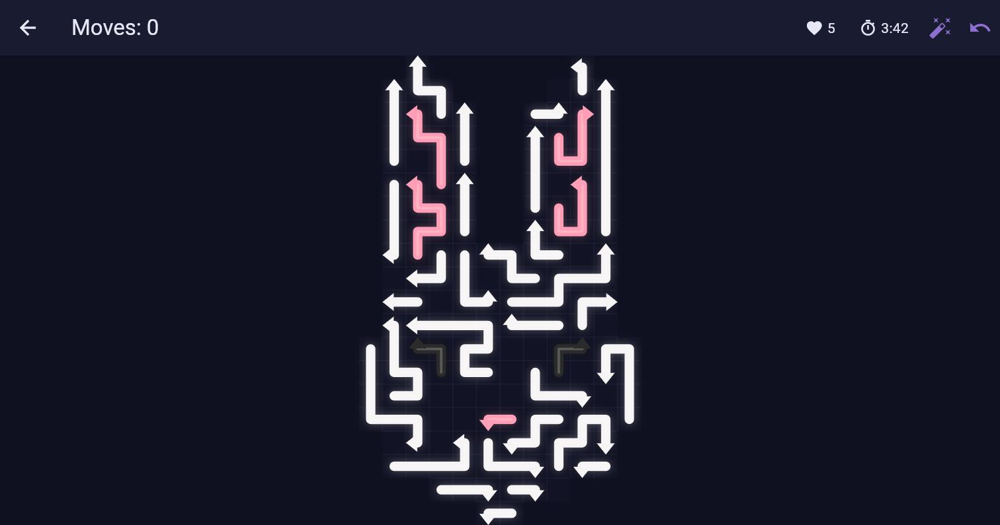
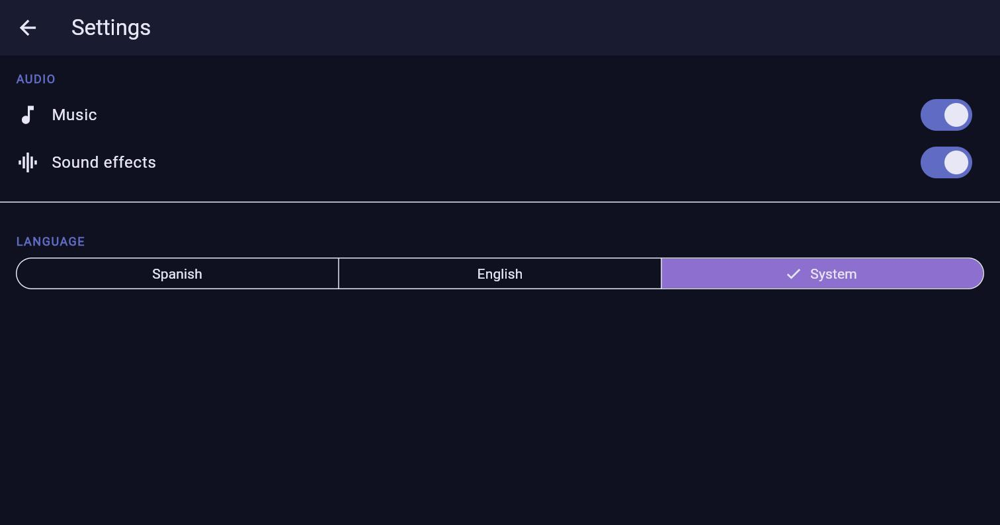
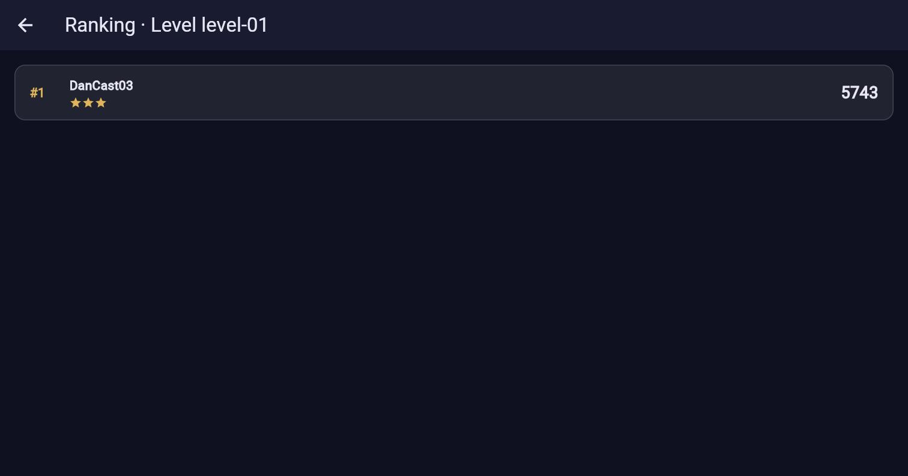
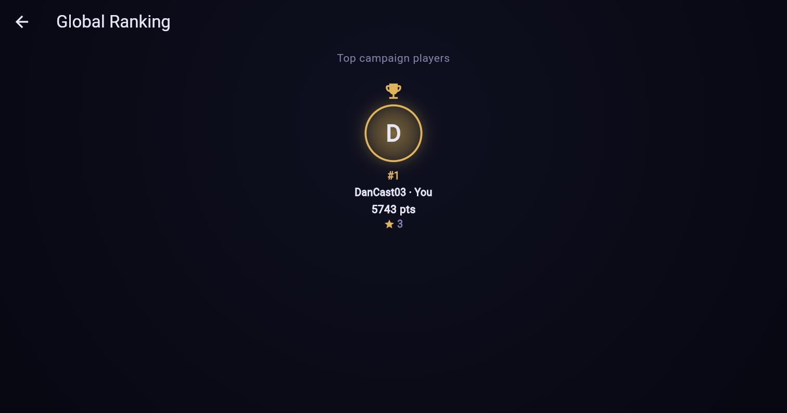
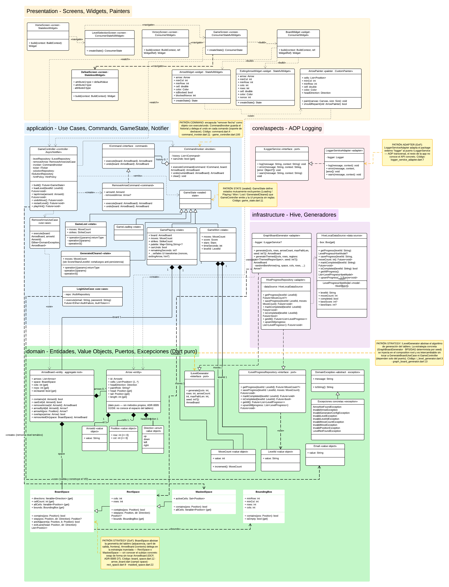

# Arrow Maze — Flutter Client

[](https://github.com/DanCas03/MazePruebaFront/actions/workflows/ci.yml)


> CI runs `flutter analyze` + `flutter test` on every PR and on `main` (see [.github/workflows/ci.yml](.github/workflows/ci.yml)); `main` requires a green build plus one review to merge.

A casual mobile puzzle game built with Flutter. The board is filled with multi-cell arrows of varying sizes and directions. Tap an arrow to slide it in its facing direction; if the path to the board edge is clear of other arrows, it exits. Clear every arrow to win the level.

## Description

Arrow Maze is the client half of a two-repository project (the [backend API](https://github.com/DanCas03/MazePruebaBack) serves levels and authentication). The interesting part is the structure: this is **Clean Mobile Architecture** (Petros Efthymiou) applied to Flutter. The `domain/` layer is pure Dart with no Flutter, Hive, or Riverpod imports; game rules live there. The UI consumes Riverpod providers from `application/` and never reaches into `infrastructure/` or `domain/` directly. Undo is a real Command pattern, the board is an Aggregate Root, and the level generator builds solvable-by-construction puzzles of bent, serpentine arrows on a tall, densely packed board.

**Tech stack:** Flutter (Dart >= 3.3), Riverpod for state and DI, Hive CE for local persistence, `dartz` for `Either`/`Option`, `equatable` for value equality, `logger` behind an AOP adapter, `audioplayers` behind an audio facade, `build_runner` for code generation, and `flutter_test` + `mockito` for tests.

## Screenshots

Captured from the web build (`docker compose up`) against a freshly seeded backend. The dark-neon palette and glowing 3-D arrows are procedural — `ArrowPainter`/`ArrowWidget`, no image assets.

| | | |
|---|---|---|
|  Home |  Level selection (earned stars) |  Gameplay |
|  Victory |  Defeat (time expired) |  Themed level (figure board) |
|  Settings (audio + language) |  Per-level leaderboard |  Global ranking |

## Architecture

The dependency rule points inward: `infrastructure` and `presentation` depend on `application`, `application` depends on `domain`, and `domain` depends on nothing external.

```
lib/
├── domain/          Pure Dart — entities, value objects, exceptions, port interfaces
│   ├── arrows/      Arrow, ArrowBoard (aggregate root), ArrowId, ArrowLength, ILevelGenerator, Difficulty, GeneratorConfig, GeneratedBoard
│   ├── board/       LevelId, Level, LevelFailure, SolutionFailure, ILevelRepository, ISolutionRepository, HintPolicy, ILevelProgressRepository, IRemoteProgressRepository, ProgressReconciler
│   ├── game_core/   Position, Direction, MoveCount, Score, Stars, space/ (BoardSpace, RectSpace, MaskedSpace)
│   ├── leaderboard/ ScoreEntry, LeaderboardEntry, GlobalLeaderboard(+Entry), ILeaderboardRepository (port — submit + read + global read)
│   ├── auth/        Email, AuthToken, IAuthTokenStorage (port)
│   └── core/        Domain exception hierarchy
├── application/     Use cases, Commands (undo), GameState (sealed), Riverpod Notifiers
│   ├── commands/    ICommand, CommandInvoker, RemoveArrowCommand
│   ├── state/       GameState / AuthState (sealed), GameController / AuthController (AsyncNotifier)
│   ├── use_cases/   RemoveArrowUseCase, RestoreSessionUseCase (auto-login), LoginUseCase, RegisterUseCase, SyncProgressUseCase, SubmitScoreUseCase, GetLeaderboardUseCase, GetGlobalLeaderboardUseCase, GenerateBoardUseCase
│   └── providers/   leaderboard_providers.dart (submitScoreUseCaseProvider, scoreSubmissionObserverProvider — Observer, getLeaderboardUseCaseProvider, leaderboardProvider — FutureProvider.family, getGlobalLeaderboardUseCaseProvider, globalLeaderboardProvider), level_catalog_provider.dart (levelCatalogProvider — remote catalog + campaign prefetch)
├── infrastructure/  Hive persistence, secure token storage, RemoteAuthRepository, RemoteProgressRepository, RemoteLeaderboardRepository, RemoteLevelRepository (campaign, `levels_cache` box), GraphBoardGenerator (implements the domain ports)
├── presentation/    Screens, Widgets, Painters + providers/ (the only place infra is built)
│   ├── auth/        Login/register screens (LoginScreen, RegisterScreen) and shared auth widgets
│   └── leaderboard/ LeaderboardScreen (per-level ranking view), GlobalLeaderboardScreen (global player ranking)
├── core/            Cross-cutting: aspects/ (logger), auth/ (AuthGate route guard), config/ (AppConfig), di/ (composition root), network/ (DioClient, AuthTokenInterceptor), theme/, router/
└── l10n/            i18n (front#4): app_en.arb / app_es.arb + generated AppLocalizations delegate (see Tooling → Localization)
```

The rule that keeps the boundary honest: `domain/` imports nothing from Flutter, Hive, or Riverpod, and every Riverpod provider that constructs a concrete `infrastructure/` class lives in `presentation/providers/`.

### Diagrams

[`docs/diagrams/class-diagram.png`](docs/diagrams/class-diagram.png) — class diagram of the main entities, use cases, ports, and adapters, color-coded by Clean Architecture layer (Presentation / Application / core-aspects / Infrastructure / Domain), with the GoF patterns from the table below called out inline:



`BoardSpace` (`domain/game_core/space/`) concentrates the board's geometry — adjacency, exit lanes, the frontier a snake-arrow exits through — behind `step`/`contains` primitives; `RectSpace` is the only production implementation, and `ArrowBoard` holds a `space: BoardSpace` instead of raw `cols`/`rows` (ADR-0005). A second, test-only implementation (`HoledRectSpace`, holed board) certifies the seam is real: `ArrowBoard.canExit` runs over it with zero consumer changes. Every space also exposes a `BoundingBox get bounds` (default derived from `allCells`, `RectSpace` in O(1)); `ArrowBoard.cols/rows` delegate to it instead of downcasting to `RectSpace`, so a non-rectangular geometry no longer breaks the aggregate (#85, Fase 1 toward arbitrary board shapes and themed silhouettes). A second production implementation, `MaskedSpace`, extends `RectSpace` with a `Set<Position> activeCells` (an arbitrary subset of the cols×rows box): `contains` is in-box AND in-set, `allCells`/`cellCount` reflect the mask, and a masked-out cell is a frontier (a `step` landing on it returns null) — the production sibling of `HoledRectSpace` that renders silhouettes, certified over `ArrowBoard.canExit` with zero consumer changes (#86, Fase 1).

- **Space-aware rendering (front#87)**: `BoardView` sizes, paints, and hit-tests through `BoardSpace` (`space.bounds` + `contains`), not a `cols×rows` rectangle. `BoardSurfacePainter` paints the full rounded panel (pixel-identical to the previous render) when the space fills its bounding box, and only the existing cells — with grid lines only between existing neighboring cells — when the space is masked. Taps on cells that don't exist are rejected before resolving any arrow.
- **Themed board as a full box (front#99, reverts the #88 silhouette)**: the silhouette derived from the **union of the initial arrows' cells** (front#88) left unpainted any interior cell of the figure that no arrow occupied, showing up as **mid-board holes** (themed production only covers ~90% of the mask). Confirmed with the maintainer that showing the **full rectangle** is acceptable, `GameController._mountedBoard` now mounts **every** level — themed or campaign — over its `cols×rows` box (`RectSpace`): no holes, and every tap lands on a painted cell (the entire box is). Themed identity comes from the **arrow colors** (`palette`), not the board's outline. `ArrowBoard.withSilhouetteSpace()` is removed for having no consumer left; `MaskedSpace` remains a certified production type (a seam for finer persisted masks → a future finer-themed-masks issue). Space-aware rendering (front#87) stays intact: filling the box paints through the full-panel path.
- **No-dead-end navigation (front#103)**: the "way back" to the menu now lives centralized in `AppRouter` as a single source of truth — `backToLevels(context)` keeps the `home` root ('/') under the selector (the `AppBar`'s back arrow persists; victory/defeat/load-error) and `exitToHome(context)` does a `popUntil` back to that root **without removing it** (preserving `AuthGate`, so reactive sign-out keeps working; used by the "Exit" action in the generated-board flow). No screen is left as a bare root. Route-by-route audit in [`docs/navigation-audit.md`](docs/navigation-audit.md).

## Tooling

### Level candidate production — Ramp + CLI (front#65)

    dart run tool/level_production/produce.dart --tier <1..5> --seeds <A..B> [--out <dir>] [--finale] [--budget <sec>]

Runs the **production Ramp** ([`tool/level_production/ramp.dart`](tool/level_production/ramp.dart)) —
the campaign's difficulty curve, successor to the retired `LevelBlueprint` —
over a range of seeds and freezes one arrow-path JSON per candidate plus a
batch manifest. The Ramp maps each tier to dimensions, density
(`fillRatio`), max path length, and (from T3 onward) a derived `timeLimitSec`
(`arrowCount × 4`, rounded up to multiples of 30; T1–T2 have no
limit). The campaign keeps its 15 = 5 tiers × 3 structure and finishes with a 50×50
(`--tier 5 --finale`, level 15, `fillRatio` 0.65).

Examples:

    dart run tool/level_production/produce.dart --tier 3 --seeds 300..309
    dart run tool/level_production/produce.dart --tier 5 --finale --seeds 900..909

Each candidate carries a traceable `cand-tN-sNNN` id (tier + seed; a
**placeholder** until curation assigns the final identifier) and a placeholder
`order` = tier. Output goes to `out/candidates/` by default (the directory is
created recursively if it doesn't exist):

- `cand-tN-sNNN.json` — JSON `{levelId, order, cols, rows, timeLimitSec?, arrows[]}`.
- `manifest-tN.md` — batch table (dims, arrows placed/requested, density
  achieved, duration).
- `errors-tN.md` — error manifest (only if some seed failed).

**Deterministic** (same seed + parameters ⇒ identical JSON within the same
SDK version; the real frozen artifact is the JSON committed to git). **Built-in
validation** before writing: every candidate passes *no-overlap* + *clears in
reverse placement order* (solvability by construction). **Resilient**:
each seed is generated in an isolate with a time budget (`--budget`, 5 s
by default); a seed that exceeds the time limit or fails validation is logged
in the error manifest and the batch continues. The candidates chosen during
curation feed the back's seed (back#10).

### Themed level production — Masks + CLI (front#68)

Extends the same tooling for the themed track (ADR 0004): levels whose
board **draws a figure** (heart, happy face, bunny — at least 3). The figure
is derived from a reference image into a **Mask**: a reviewable text spec
(`tool/level_production/masks/*.mask`) with a grid of one glyph per
cell plus a `glyph = role : #hex` legend. No computer vision, no
new dependencies; a person curates the grid by preview. `.` is the
background (no arrows): the figure floats over an empty board.

    dart run tool/level_production/produce_themed.dart --masks-dir <dir> [--out <dir>] [--coverage <0..1>] [--seeds <A..B>] [--dense <bool>] [--maxlen <n>]
    dart run tool/level_production/produce_themed.dart --mask <file.mask> [options]

The producer confines **each arrow to a single color region** (one arrow = one
color; it exits whole), tagging a `paintRole` per arrow plus a level-level
`palette` of roles→hex (ADR 0004; the back stores and serves them as opaque
data). Regions are generated **detail-first** (smallest to largest) so
interior ones find a free exit lane; they share a **global** occupancy that
preserves solvability (the board clears in reverse placement order, verified
with `validateCandidate`). The JSON also emits the **`silhouette`** (#118): the
full fill of the mask's regions, role→cells — the level's playable shape
(see the next section), independent of arrow coverage.

Since #118 the default mode is **dense** (`--dense true`):
`GraphBoardGenerator.generateThemedDense` fills the figure to ~97-99% and the
seed is chosen by **sweeping the full range** with the same lexicographic
criterion as the guard tests in `graph_board_themed_dense_test.dart` —
1) detail regions at 100% (the happy face's eyes/mouth ARE its
identity), 2) no free cell at depth > 2 from its region's border
(no holes in the middle of the figure), 3) and only then, higher coverage.
Choosing by coverage alone is not Pareto-optimal and is forbidden: it would
win a cell while leaving visible interior pockets. Without an admissible seed
the producer fails loudly (widen `--seeds` or retouch the mask). `--maxlen`
only applies to the legacy mode (`--dense false`, the original `generateThemed`
which retries until it hits the target coverage); in dense mode the length
policy is frozen by the guard tests. Reports per-role coverage in
`manifest-themed.md` plus a **color ANSI preview** per figure for curation.
Themed levels **carry no time limit** in v1 (the absence of the
`timeLimitSec` field is the annotation).

The 3 frozen fixtures live in `tool/level_production/themed/` and feed
the back's themed Section (replacing the `t-smoke` smoke fixture). `themed-heart`
(36×24, seed 67) and `themed-happy_face` (24×22, seed 41) are produced with
`--mask <heart|happy_face>.mask --out tool/level_production/themed --coverage 0.90 --seeds 0..99`.
`themed-bunny` is **frozen** (the maintainer's aesthetic benchmark): it is not
regenerated — its 37 arrows stay byte-identical, protected by
`themed_bunny_characterization_test.dart` — and it earned its `silhouette` via
the one-off `tool/level_production/add_silhouette.dart`.

### Themed levels — the silhouette IS the board (front#118)

A themed level is played over the **figure**, not its box: outside the
silhouette **there is no board** — nothing is painted and no taps are accepted. The
level's wire brings, alongside the rectangular board, a **Silhouette**
([`Level.silhouette`](lib/domain/board/entities/level.dart)): a role→cells map
of the figure's fill (null for campaign; `silhouetteUnion` gives its union).

Mounting happens in a single application-layer **seam**,
`GameController._mountedBoard`, invoked on every start, restart, undo, and hint
demo: if the level declares a silhouette, its board is **re-mounted** (`ArrowBoard.remountedOn`)
over a [`MaskedSpace`](lib/domain/game_core/space/masked_space.dart) with the
silhouette's union as active cells; if it doesn't declare one — campaign —, it
keeps the wire's `RectSpace` intact. Since a masked cell is a **frontier**
(`step` → `null`), the exit mechanics (`exitLane`/`canExit`) operate over
any figure without touching a single line of their consumers (OCP), and presentation
adapts on its own: `BoardSurfacePainter` walks its cell-by-cell path and
`BoardWidget` vetoes the tap with `space.contains` before resolving any arrow.
The *arrows ⊆ silhouette* invariant is guaranteed by `Level`'s constructor, so
the figure never leaves an arrow outside the board.

This **reverts the "full box" decision** from front#99/#107 **only** for
themed levels with a silhouette: that decision avoided the mid-board holes left
by cropping to the arrows' cells (front#88), but the explicit silhouette already
includes the figure's interior cells, so the shape is drawn whole and
with no gaps. The campaign is unchanged: same `RectSpace`, same render.

### Remote campaign (front#8)

Campaign levels are no longer generated locally: the official back serves them. `GET /levels` returns the Catalog in play order —a list of `CatalogEntry { LevelId id; LevelSection section }`, with `section` additive (absent ⇒ `campaign`; see *Themed section* below)— and `GET /levels/:id` the full level (`ArrowBoard` + arrows). The app depends on the [`ILevelRepository`](lib/domain/board/repositories/i_level_repository.dart) port (`listCatalog()` + `getLevel()`); the [`RemoteLevelRepository`](lib/infrastructure/repositories/remote_level_repository.dart) implementation is network-first with a cache fallback: with network, it refetches and writes through to a `levels_cache` Hive box; without network (or on a non-404 server error), it serves the cached copy. A 404 from the back for a specific level is authoritative (`LevelNotFound`) and does not consult the cache.

[`levelCatalogProvider`](lib/application/providers/level_catalog_provider.dart) (`LevelCatalogNotifier`, `AsyncNotifier`) loads the Catalog on startup and fires a background sequential prefetch of the whole campaign via `getLevel` (which caches as a side effect); individual prefetch failures are logged and swallowed. After one online visit, the campaign stays playable **offline**. "Next level" on the victory screen follows the Catalog's order **over campaign levels** and **respects Tier gating** (front#81): the CTA only appears if the next level is unlocked. The app needs to reach the back at `AppConfig.apiBaseUrl` (defaulting to `http://10.0.2.2:3000` for the Android emulator, configurable with `--dart-define=API_BASE_URL=...`).

The local generator ([`GraphBoardGenerator`](lib/infrastructure/generators/graph_board_generator.dart)) is kept in the code but no longer feeds the campaign; it now feeds the "Generate level" feature (front#36) for ephemeral boards — see *Tooling → Player-generated boards*.

> **Note (front#9 — reconciliation).** The *swappable remote/procedural Strategy* envisioned by the backlog (E1.5) and issue front#9 —with procedural generation as a "practice/fallback mode"— was **deliberately not built**. After the cutover (ADR 0001, in the workspace's `docs/adr/`), the campaign's level source is **pure DIP**: the [`ILevelRepository`](lib/domain/board/repositories/i_level_repository.dart) port with a **single production Adapter** (`RemoteLevelRepository`), not a family of strategies inside `loadLevel`. **Offline** is solved by the **cache** (network-first, above), not a generated board; with neither network nor cache the result is `LevelUnavailable`, not a replacement board. Procedural generation is a **separate feature** —`GeneratedBoard`, front#36/#37—: its boards are ephemeral, have no `LevelId`, no score or progress, and **never** substitute for an official `Level`. (`GraphBoardGenerator` is indeed a Strategy, but of `ILevelGenerator`, not of the campaign.) That's why front#9 is closed as documentation: criteria 1 and 3 were delivered by front#8, and criterion 2 was superseded by this design.

### Auto-solver (#102, evolution of the "hint" #32)

On **every** campaign level (eligibility opened up in [`HintPolicy`](lib/domain/board/services/hint_policy.dart); previously restricted to level number ≥ 7) and on themed levels, the AppBar shows an **auto-solver** control — explicitly presented as such (a magic-wand icon, not an ambiguous "hint" lightbulb) that replays the server's canonical solution as a **non-scoring demo**. Tapping it first opens a **confirmation dialog** warning that the current attempt's progress will be lost; *Cancel* leaves the game untouched. Only on confirm does `GameController.playHint()` request the *Solution* from the back (`GET /levels/:id/solution`, back#19) through the [`ISolutionRepository`](lib/domain/board/repositories/i_solution_repository.dart) port; the [`RemoteSolutionRepository`](lib/infrastructure/repositories/remote_solution_repository.dart) implementation maps the response (`{levelId, solution: [ids]}`) to `List<ArrowId>` in clearing order. The client **replays that order verbatim** — it never derives the sequence — resetting the board and animating each arrow's exit by reusing the same *exit animation* mechanism (`exitingArrow` + `exitNonce`) as a real tap. During the demo, input and undo are **locked** and neither moves nor collisions are counted (the `CommandInvoker`'s undo stack is untouched); when it finishes, the level **resets and stays playable**. No score is submitted and the level is not marked completed.

**Size-scaled pacing ([`AutoSolvePacing`](lib/domain/board/services/auto_solve_pacing.dart), #102).** The delay between steps is no longer a constant: it decreases with the Solution's arrow count (T1 boards with ~7 arrows replay deliberately at 420 ms/step; T5 boards with ~120-180 arrows speed up to a floor of 120 ms/step), with a **floor** that never lets a step start before its exit animation finishes — both curves converge exactly at that same minimum, so the floor never "wins" by surprise over an unreachable target. For the largest boards that same floor drops further by **compressing the exit animation** in this mode (from 360 ms down to 120 ms) — `GamePlaying.autoSolveExitDuration` travels in the state only during `hintPlaying`, and `ExitingArrowWidget` uses it instead of its default (`AutoSolvePacing.standardExitDuration`, the single source also reused by `BoardView`); normal gameplay never sees it.

Two robustness additions beyond what was requested (inherited from #32):

- **Loading sub-state.** While the HTTP request is in flight, `GamePlaying.hintLoading` turns the icon into an inert *spinner*, mitigating accidental double-clicks; a generation token (`_hintRun`) invalidates any in-flight demo if the player loads another level, restarts, or the screen is destroyed.
- **Strict timeout.** [`SolutionRemoteDataSource`](lib/infrastructure/data_sources/remote/solution_remote_data_source.dart) imposes a per-request `receiveTimeout` (5 s, shorter than Dio's global one): if the back is slow or fails, the call **breaks cleanly** to `SolutionUnavailable`, an error *snackbar* fires, and **the game in progress stays intact**. There is no cache: the auto-solver is on-demand, and offline resolves to "unavailable" instead of serving a stale copy. A 404 maps to `SolutionNotFound` and a 422 (unsolvable level) to `SolutionUnsolvable`.

Consistent with **ADR 0002**: only the back's curated levels have a *Solution*; generated boards (front#36) don't have one and are out of scope for this feature.

### Auth flow

Login and registration hit the backend at `POST /auth/login` and `POST /auth/register` (base URL configurable via `--dart-define=API_BASE_URL=...`, defaulting to `http://10.0.2.2:3000` for the Android emulator). Registration requires `email`, `username` (3-20 chars, letters/digits/underscore, validated client-side by the `Username` VO — the back rejects a missing/invalid one with 400) and `password` (≥8 chars); a taken email or username gets a 409, mapped to `EmailAlreadyRegistered`. A successful call persists the returned JWT through `IAuthTokenStorage` (front#14); `AuthGate`, sitting at the `MaterialApp`'s `home`, watches `authControllerProvider` and swaps from `LoginScreen` to the game flow (`HomeScreen`) as soon as the session becomes `Authenticated` — no manual navigation call is needed after login.

### Progress sync (front#18)

On the `Unauthenticated → Authenticated` transition (login or auto-login), `AuthGate` fires `SyncProgressUseCase.execute()` once via `ref.listen`. The use case pulls the server's progress (`GET /progress`) through the `IRemoteProgressRepository` port (`RemoteProgressRepository`, Dio-backed, in `infrastructure/`), reconciles it with the local Hive progress using the domain service `ProgressReconciler` — best score wins per level, and a level completed on either side stays completed — pushes the merged result back (`POST /progress`), and persists it locally through `ILevelProgressRepository`. The sync is fire-and-forget: network failures are logged (AOP) and swallowed, so a sync failure never blocks the auth guard or the game flow.

**Known limitation:** with "remember me" unchecked (`remember: false`), `AuthTokenInterceptor` does not yet sign requests from the in-memory session, so the sync's authenticated calls only succeed when "remember me" is checked, until front#16 fixes the interceptor.

### Account panel (front#78)

The start screen carries an account icon (top-left, mirroring the Settings gear) that opens a modal bottom sheet with the signed-in player's profile and a **Sign out** action. The `username` and `email` come from the protected `GET /auth/me` endpoint (back#44) through the `IAuthRepository.me()` port (`RemoteAuthRepository`), surfaced to the UI by `GetCurrentUserUseCase` and the `currentUserProvider` (a `FutureProvider.autoDispose` that re-fetches on each open and exposes load/error/retry states). Progress totals — **total stars** and **completed levels** — need no backend: `progressTotalsProvider` reduces the local Hive progress (`ILevelProgressRepository.getAll()`) via the `ProgressTotals` read model. Sign out calls `AuthController.signOut()`, which clears the token from memory and secure storage; `AuthGate` then swaps to `LoginScreen` (which offers register / log in) with no manual navigation, and a subsequent app restart does not auto-login. The panel widget consumes only `application/` providers — no direct `infrastructure/` or `domain/` access — and every string is localized (`accountTitle`, `accountSignOut`, `accountStarsTotal`, `accountLevelsCompleted`, …).

### Localization (i18n · front#4)

The app ships Spanish (`es`, primary) and English (`en`), selected automatically from the device locale. Strings live in ARB files under [`lib/l10n/`](lib/l10n/) (`app_en.arb` is the key template, `app_es.arb` the Spanish translation); [`l10n.yaml`](l10n.yaml) drives `flutter gen-l10n`, which produces the `AppLocalizations` delegate. Because `flutter: generate: true` is set in `pubspec.yaml`, the delegate is regenerated on every `flutter pub get` / build, so the generated `lib/l10n/app_localizations*.dart` files are **not** committed (they are git-ignored).

Screens read strings through `AppLocalizations.of(context)`; there is no static string table. To add or change a string: edit both ARB files (same key), then run `flutter gen-l10n` (or `flutter pub get`). Messages with runtime values use ICU placeholders, e.g. `gameMoves(count)` → `"Moves: 3"` / `"Movimientos: 3"`.

### Settings & live language switching (front#19)

The **Settings screen** (gear icon on Home, route `/settings`) exposes **independent** Music (BGM) and SFX toggles over the [`IAudioService`](lib/application/audio/i_audio_service.dart) facade, plus an **ES / EN / System** language selector — all persisted. Because the facade's mutes are plain getters (not observable), a Riverpod `Notifier` (`audioSettingsControllerProvider`) publishes a reactive `AudioSettingsState` and delegates each toggle to a thin use case (`ToggleMusicUseCase` / `ToggleSfxUseCase`). Language is driven by `localeControllerProvider` (a `Notifier<Locale?>`, `null` = follow the OS; the **System** segment sets it back to `null`): `ArrowMazeApp` watches it and sets `MaterialApp.locale`, so switching language **rebuilds the tree and re-evaluates every `AppLocalizations.of(context)` live**, with no restart. The controllers receive their dependency (`IAudioService` / `ILocaleStore`) **by constructor** — `application/` never imports `presentation/`, and `main` composes the real instances via `overrideWith` (same pattern as `gameControllerProvider`). The choice persists behind the `ILocaleStore` port (`HiveLocaleStore` over the `app_settings` box; `InMemoryLocaleStore`, in `application/settings/`, is the default null-object). `SetLanguageUseCase` performs the persistence.

### Score submission (front#16)

On winning a level, `GameController` computes the run's PREVIEW `Score`/`Stars` and emits an enriched `GameWon` state (`{moves, score, stars, timeSeconds, collisions, levelId}`). An Observer (`scoreSubmissionObserverProvider`), activated by `GameScreen` via `ref.watch`, listens to `gameControllerProvider` and, on `GameWon`, builds a `ScoreEntry` and fires `SubmitScoreUseCase` fire-and-forget. The use case sends `POST /scores` with the run's raw metrics (`{levelId, moves, timeSeconds, collisions, previewScore}`, ADR 0006) through `RemoteLeaderboardRepository` (implements the domain port `ILeaderboardRepository`) and `LeaderboardRemoteDataSource` (Dio); `previewScore` (the client's own `Score.fromRun` estimate) travels for audit/telemetry only — the back derives the CANONICAL result from the raw metrics, not from the preview. The request is signed with the live session's Bearer token via `ISessionTokenStore`, which also covers `remember: false` sessions (front#16's interceptor fix).

The back's response (`{score, stars}`) is parsed into a `CanonicalResult` VO and returned by `SubmitScoreUseCase.execute` (`Future<CanonicalResult?>`, `null` on failure — a network error or an invalid response is logged (AOP) and swallowed, so the victory screen is never blocked by the submission). On success, the Observer publishes the canonical result to `canonicalResultProvider` and re-invokes `RecordLevelCompletionUseCase` with the canonical `score`/`stars` (its existing best-of merge makes the re-record idempotent). `VictoryScreen` watches `canonicalResultProvider`: while it is `null` (submission in flight or failed) it renders the client's preview from `GameWon`/`VictoryArgs`; once the back responds, the canonical score/stars replace the preview silently, with no loading spinner.

### Leaderboard view (front#17)

The level-selection screen exposes a ranking icon per level; tapping it opens `LeaderboardScreen`, which reads the public `GET /leaderboard/:levelId` (back#9). The screen watches `leaderboardProvider` (`FutureProvider.autoDispose.family` keyed by `levelId`), which runs `GetLeaderboardUseCase` through the same `ILeaderboardRepository` port — now cohesive around submit **and** read. `RemoteLeaderboardRepository.getLeaderboard` maps the back's rows (`{id, userId, username, levelId, score, stars, moves, timeSeconds, createdAt}`) to `LeaderboardEntry`, preserving the server's score-desc order (rank is positional). The UI renders the three `AsyncValue` states — a loading spinner, an error state with a retry button, and the ranked list (empty state when a level has no scores yet). Unlike the fire-and-forget submit, the read use case rethrows on failure so the UI can surface the error. The tile shows the entry's `username` (front#50) rather than the raw `userId` UUID.

### Global leaderboard (ADR 0006)

The home menu exposes a **Ranking** entry (trophy icon) that opens `GlobalLeaderboardScreen`: the global player ranking by **campaign totals** — the back aggregates each player's *best* score and *best* stars per campaign level (themed levels and `GeneratedBoard` never count) and serves `GET /leaderboard` (JWT) as `{top, me|null}`. `rank` travels on the wire (unlike the per-level ranking it is not positional: the player's own row can sit outside the top). The screen watches `globalLeaderboardProvider` (`FutureProvider.autoDispose` over `GetGlobalLeaderboardUseCase`) and renders a **podium** for the top 3 (gold/silver/bronze accents), glass rows from 4th on, and the player's own row — highlighted in place when inside the top, **anchored under the list** when outside it, or an "unranked" footer when `me` is `null` (no campaign score submitted yet). Corrupt rows degrade gracefully (skipped with a warn; a corrupt `me` degrades to unranked) mirroring `getLeaderboard`. Pull-to-refresh re-queries; the three `AsyncValue` states follow the per-level screen's pattern.

### Level selection (front#20 + front#8)

`LevelSelectionScreen` renders the **remote catalog** grouped by **Tier** — difficulty rungs of three levels each, which also drive the difficulty labels shown to the player (Easy / Medium / Hard). Each unlocked tile shows the level's **position in the catalog** (the backend's `LevelId` is opaque and only travels in navigation/scoring) and the level's earned stars (0–3), and navigates to the game on tap (plus the per-level ranking icon from front#17); each locked tile shows a padlock and does nothing. The catalog list comes from `levelCatalogProvider` (front#8): `GET /levels` through the `ILevelRepository` port, downloaded once per session, with an opportunistic background prefetch of the whole campaign so one online visit makes it playable offline. The Tier of each level derives from its **position** in the catalog (`Tier.forLevelNumber(position)`) — never from arithmetic on the id.

Gating lives in the pure domain service `TierGating`: the first Tier is always open, and a Tier unlocks once **every** level of the lower-ranked Tiers is completed. `LevelSelectionController` (`AsyncNotifier`) composes the catalog (via `ref.watch` on `levelCatalogProvider`), the local progress (`ILevelProgressRepository.getAll`, whose `bestStars` feed the star row and degrade to 0 when no score exists yet) and `TierGating` into a `CatalogView` (campaign `TierSection`s + themed `LevelTile`s). The screen invalidates the provider on entry (`ref.invalidate` in a post-frame callback) and on reveal-by-pop (`RouteAware.didPopNext`), so returning from a won level reflects the freshly earned stars and any newly unlocked Tier — re-reading only the local progress, since the already-resolved catalog is reused. If the catalog fails (offline and no cache), the screen shows an error state with a retry button that refreshes the catalog.

**Themed section (front#67, back#31/ADR 0004).** `GET /levels` now returns `[{ levelId, section }]`, with `section` **additive**: absent or unknown ⇒ `campaign` (`LevelSection.fromWire`). Each entry is a `CatalogEntry { LevelId id; LevelSection section }`. Themed levels are real levels — they score and persist like any other — but have **no Tier gating** and **no "next level" adjacency**. The controller splits the catalog: campaign entries keep exactly today's behavior, tiered by their position **among campaign-only entries** (so interleaving themed levels never shifts campaign Tiers); themed entries become a separate block of tiles that are **never locked**. Since front#100 the themed tiles live in their **own screen** (`ThemedSelectionScreen`, route `/themed`) reachable from a dedicated **"Themed levels"** CTA on the Home screen — not embedded at the tail of `LevelSelectionScreen` anymore. Both screens share the `LevelTileView`/`LevelTileGrid` widgets (`presentation/level_selection/widgets/`), so a themed tile navigates with the real `LevelId` on tap exactly like a campaign tile; the themed screen shows an empty-state message when the catalog has no themed levels. `LevelSelectionScreen` now renders only the campaign Tiers. On the victory screen, the next step is resolved by the pure domain service `CampaignProgression` (via `nextLevelOutcomeProvider`, composing catalog + progress) over **campaign ids only** and **respecting `TierGating`** (front#81): the "next level" CTA appears **only when the next campaign level's tier is unlocked**, evaluated against progress that *includes the just-won level* (completion persists fire-and-forget, so the check can't wait on it). When the next tier is still locked it shows an unlock-requirement message instead of the CTA; a themed level (its id not among the campaign ids) offers neither that nor "campaign complete", only "Back to Levels". Offline degrades themed levels to hidden (the id-only cache re-hydrates every entry as `campaign`), an accepted v1 tradeoff. Since front#125 the catalog also carries a third, orthogonal collection `hexTiles` (`CatalogView`), populated from entries whose `section == hex` (ADR-0007 D6) — free tiles with no Tier and no gating, mounted on hexagonal geometry. `section` and the level's `space` are independent: a themed level on a hex board is `section: themed` (it stays among `themedTiles`, not the hex mode). The hex-mode selection screen that renders `hexTiles` is front#127; front#125 only populates the state.

**Hex mode (front#127, ADR-0007 D6).** `HexSelectionScreen` (route `/hex`) renders `hexTiles` and is reachable from a dedicated **"Hex mode"** CTA on the Home screen, mirroring how the themed CTA opens `/themed`. Like themed tiles, hex tiles are **free**: no Tier, no gating, no "next level" adjacency, and they reuse the same `LevelTileView`/`LevelTileGrid` widgets, so a hex tile navigates with the real `LevelId` on tap exactly like a campaign or themed tile. Completing a hex level goes through the exact same pipeline as any other level — `GameController` → `levelCompletionObserverProvider` → `RecordLevelCompletionUseCase` — so local persistence and score submission to the general leaderboard (ADR 0006) work unchanged; the hex board's `space.type == 'hex'` only affects rendering (front#125's `Level.contains`/masked seam), never the completion or scoring path.

### Player-generated boards (front#36) — application half

"Generate level" lets the player request an **ephemeral, locally generated, solvable board**: board dimensions, a difficulty preset, an optional timer and an optional seed. This issue ships the **domain + application half** of the feature; the UI that collects the input and plays the board is a separate issue. The resulting artifact is a **GeneratedBoard** (see the glossary in [`CONTEXT.md`](CONTEXT.md)): unlike a `Level`, it has no `LevelId`, is never scored, never persisted, and never touches `Progress` or the leaderboard — it is played and discarded, reproducible via `(seed, config)` within the same app version.

**[`GeneratorConfig`](lib/domain/arrows/value_objects/generator_config.dart)** is a defensive value object: it can only be built through the `GeneratorConfig.create` factory, which validates that `cols` and `rows` fall in the playable range **4–50 inclusive** (`minDimension`/`maxDimension`, adjustable in one place; the ceiling rose from 10 to 50 in front#66 once the zoom/pan viewport made large boards legible on mobile) and throws the semantic domain failure [`InvalidGeneratorConfigException`](lib/domain/core/exceptions/invalid_generator_config_exception.dart) otherwise. **front#101:** on top of the dimension range, generated boards are also constrained to the app-wide **9:16 portrait band** ([`AspectBand`](lib/domain/arrows/value_objects/aspect_band.dart), `cols/rows` inclusive in **[0.53, 0.68]**) so a board fills a phone screen without large side margins — a shape outside the band (e.g. a square or a too-wide portrait) throws the same `InvalidGeneratorConfigException`. The player chooses *intent* (size, difficulty, timer); the internal generator parameters are **derived** from the [`Difficulty`](lib/domain/arrows/value_objects/difficulty.dart) preset constants:

| Preset | Arrow density (`fillRatio`) | `maxPathLen` | Timer budget (`secondsPerCell`) |
|---|---|---|---|
| `easy` | 0.40 | 3 | 3.0 s |
| `medium` | 0.55 | 6 | 2.0 s |
| `hard` | 0.70 | 9 | 1.5 s |

- `arrowCount` = `round(cols · rows · fillRatio / avgPathLen)` with `avgPathLen = (2 + maxPathLen) / 2`, clamped to `[4, cells ~/ 2]` — the same density model the campaign used (`LevelBlueprint`).
- `timeLimitSec` (only when `timed: true`, otherwise `null`) = `round(cols · rows · secondsPerCell)`, clamped to `[30, 300]` s.

**[`GenerateBoardUseCase`](lib/application/use_cases/generate_board_use_case.dart)** consumes the existing [`ILevelGenerator`](lib/domain/arrows/services/i_level_generator.dart) port (implemented by `GraphBoardGenerator`, whose DAG construction makes every board **solvable by construction**). If the player did not fix a seed, the use case completes it through an injectable `SeedSource` (defaulting to `Random`) — randomness is the only non-deterministic effect and it is isolated behind that seam, so tests inject a fixed source and `execute` stays pure given its input. The result is a [`GeneratedBoard`](lib/domain/arrows/value_objects/generated_board.dart) bundling the `ArrowBoard`, the **effective config** and the **seed used** (always surfaced: same seed + same config ⇒ identical board). The generator's graceful degradation (fewer arrows than requested on dense configs) is accepted as-is. The use case performs **no persistence** — no Hive boxes, no `Progress`, no score submission.

> **Homogeneous distribution.** `GraphBoardGenerator` places arrows **interior-first, by concentric bands** (spec [`2026-07-15-generator-band-density-design.md`](docs/superpowers/specs/2026-07-15-generator-band-density-design.md)): central ones are placed while the board is still empty and the perimeter last, so the interior's density is comparable to the edge's (removing the perimeter ring seen on large boards). Determinism is preserved: same seed + same config ⇒ same board.

Presentation reaches the use case through `generateBoardUseCaseProvider` in the composition root ([`dependency_providers.dart`](lib/core/di/dependency_providers.dart)), which composes the `ILevelGenerator` port with the AOP logger (the seed is logged for reproducibility).

Per **ADR 0002**, the canonical auto-solve *Solution* is produced by the backend for curated levels only; generated boards never reach the backend, carry no Solution, and the hint/auto-solve feature is explicitly out of scope for this flow — solvability is guaranteed by construction instead.

> **Performance (front#64).** `ArrowBoard` caches its occupancy set lazily per instance (it is immutable, so each `removeArrow` yields a fresh instance whose cache is recomputed once), and `GraphBoardGenerator` keeps an incremental occupancy state that is updated as each arrow is accepted instead of being rebuilt per attempt. This makes dense 50×50 generation (ADR 0003: campaign finale and XL presets) finish in well under 2 s; behavior is unchanged (same public interfaces, seed→output still deterministic).

### Player-generated boards (front#37) — UI half

The player half of "Generate level" is a self-contained flow — **Home → configurator → generated game → post-game** — that reuses the campaign's play mechanics but is walled off from all persistence.

- **Zero-persistence firewall (structural).** [`GeneratedGameController`](lib/application/state/generated_game_controller.dart) (`AsyncNotifier<GameState>`) is composed with only `GenerateBoardUseCase` + `RemoveArrowUseCase` + `CommandInvoker` + `ITicker` — it has **no** `ILevelRepository`, `SubmitScoreUseCase` or `ILevelProgressRepository`, so it *cannot* write Hive, touch `Progress` or submit to the leaderboard. Unlike the campaign screen, the generated screen never watches `scoreSubmissionObserverProvider`, so clearing a board never fires a score POST. Victory is a dedicated `GeneratedCleared` state carrying only `MoveCount` — a mirror of `GameWon` with no `Score`/`Stars`/`LevelId`.
- **Configurator.** [`ConfiguratorScreen`](lib/presentation/generated/configurator_screen.dart) collects the player's *intent*: one-tap **size presets** (S 6×10, M 9×16, L 14×25, XL 19×34 — [`kSizePresets`](lib/presentation/generated/size_presets.dart), retuned in front#101 to sit inside the 9:16 band; front#66) plus `cols`/`rows` steppers clamped to 4–50, a `Difficulty` segmented button, a timed toggle and an optional seed. [`ConfiguratorController`](lib/application/state/configurator_controller.dart) (an `autoDispose` `NotifierProvider`) drives an immutable [`ConfiguratorState`](lib/application/state/configurator_state.dart) (default shape 6×10) whose `isValid` **disables the "Play" button reactively** when the optional seed is not a whole number, dimensions fall outside the playable range, or the shape falls outside `AspectBand` (front#101).
- **Game HUD.** [`GeneratedGameScreen`](lib/presentation/generated/generated_game_screen.dart) reuses the shared `BoardView` (extracted from `BoardWidget` so both flows render identically), the move counter, the countdown (only when the player enabled the timer), undo and audio. It shows the **seed subtly** at the foot with a **copy-to-clipboard** button (`SeedChip`) and hides hints, scores and stars entirely.
- **Post-game.** [`GeneratedResultScreen`](lib/presentation/generated/generated_result_screen.dart) carries no score/stars/next-level. It surfaces the final seed (copyable) and the four required actions: **Another board** (`anotherBoard` — same config, new seed), **Replay** (`repeat` — same seed and config ⇒ identical board), **Change parameters** (back to the configurator) and **Exit** (Home).

Routes `/generate`, `/generate/play` and `/generate/result` live in `AppRouter`; `main.dart` overrides `generatedGameControllerProvider` with the real `GraphBoardGenerator`, the pure mechanics and `SystemTicker`.

> **Viewport zoom/pan + XL boards (front#66).** With presets up to 50×50 (2 500 cells), shrinking the board to fit is unplayable on mobile, so [`BoardView`](lib/presentation/game/widgets/board_widget.dart) wraps its fitted board in [`BoardViewport`](lib/presentation/game/widgets/board_viewport.dart) — a shared camera used by **both** the campaign and generated flows (it sits inside `BoardView`, the single render source). It offers pinch-to-zoom and drag-to-pan (`InteractiveViewer`) plus a **double-tap** that toggles between *fit* and a reading zoom centred on the tapped point. Tap-to-cell hit-testing stays valid at any scale because `InteractiveViewer` transforms pointer events into the board's local space. Double-tap is detected with a raw pointer `Listener` (not a `DoubleTapGestureRecognizer`, which would hold the gesture arena ~300 ms and add that latency to *every* arrow tap — the core interaction). **Viewport culling:** the camera feeds `BoardView` the visible board rectangle each frame, so only the arrows (each an `ArrowWidget` with its own `AnimationController`) and grid lines inside the frame are built/painted — the thing that keeps pan smooth on an XL board. **Non-blocking generation:** [`GenerateBoardUseCase.executeAsync`](lib/application/use_cases/generate_board_use_case.dart) offloads L/XL generation (≥ 600 cells) to a background isolate via `compute`, and `GeneratedGameController.startNew` emits `AsyncValue.loading` so the screen shows a spinner instead of freezing (deterministic: same seed ⇒ same board, isolate or not; on web `compute` degrades to synchronous).

## Design Patterns

Gang of Four patterns, distributed across the three classic categories. Each carries an inline comment at its source stating the problem it solves, per the project's pattern-usage convention.

### Creational

| Pattern | Where | Problem it solves |
|---|---|---|
| **Singleton** | [`audio_service.dart`](lib/infrastructure/audio/audio_service.dart) | `AudioService` keeps exactly one instance for the app's lifetime (a lazy `factory` constructor backed by a static field, plus a single Riverpod provider), so mute state and playback never fork across callers. |

### Structural

| Pattern | Where | Problem it solves |
|---|---|---|
| **Adapter** | [`logger_service_adapter.dart`](lib/core/aspects/logger_service_adapter.dart), [`secure_auth_token_repository.dart`](lib/infrastructure/repositories/secure_auth_token_repository.dart), [`remote_auth_repository.dart`](lib/infrastructure/repositories/remote_auth_repository.dart), [`remote_progress_repository.dart`](lib/infrastructure/repositories/remote_progress_repository.dart), [`remote_leaderboard_repository.dart`](lib/infrastructure/repositories/remote_leaderboard_repository.dart), [`remote_level_repository.dart`](lib/infrastructure/repositories/remote_level_repository.dart) | Wraps an external package/API behind a domain port, isolating the rest of the app from its concrete shape: `logger` behind `ILoggerService`, `flutter_secure_storage` behind `IAuthTokenStorage`, Dio behind `IAuthRepository` (`RemoteAuthRepository` translates HTTP/`DioException` into `AuthToken`/`AuthFailure`), behind `IRemoteProgressRepository` (`RemoteProgressRepository` maps `LevelProgress` to/from the `/progress` JSON shape), behind `ILeaderboardRepository` (`RemoteLeaderboardRepository` maps `ScoreEntry` to the `/scores` JSON shape) and behind `ILevelRepository` (`RemoteLevelRepository` maps the back's `/levels` JSON to `Level`, network-first with a `levels_cache` fallback). |
| **Facade** | [`audio_service.dart`](lib/infrastructure/audio/audio_service.dart) | `AudioService` hides players, asset-path lookup, and the **independent** mute rules (master / music / SFX) behind the single [`IAudioService`](lib/application/audio/i_audio_service.dart) entry point. The concrete `audioplayers` package sits behind the [`IAudioBackend`](lib/infrastructure/audio/i_audio_backend.dart) adapter, and mute state persists via [`IAudioSettingsStore`](lib/infrastructure/audio/i_audio_settings_store.dart) (Hive). |
| **Decorator** | [`logging_audio_decorator.dart`](lib/infrastructure/audio/logging_audio_decorator.dart) | Wraps `IAudioService` to log every audio operation through `ILoggerService` without touching the facade — the second cross-cutting aspect, applied by composition at the composition root. |

### Behavioral

| Pattern | Where | Problem it solves |
|---|---|---|
| **Command** | [`command.dart`](lib/application/commands/command.dart), [`command_invoker.dart`](lib/application/commands/command_invoker.dart), [`remove_arrow_command.dart`](lib/application/commands/remove_arrow_command.dart) | Models a move as a reversible operation. The invoker keeps history and delegates `undo` back to each command, so reversal logic lives with the operation. |
| **Observer** | [`leaderboard_providers.dart`](lib/application/providers/leaderboard_providers.dart) | `scoreSubmissionObserverProvider` listens to `gameControllerProvider` and reacts to `GameWon` by submitting the score, decoupling `GameController` from the leaderboard concern entirely. |
| **Strategy** | [`graph_board_generator.dart`](lib/infrastructure/generators/graph_board_generator.dart) | `GraphBoardGenerator` implements `ILevelGenerator` as a swappable generation algorithm (a DAG that guarantees solvability). No longer feeds the campaign (front#8 moved that to the back's official levels); it now powers the ephemeral player-generated boards consumed by `GenerateBoardUseCase` (front#36). |

### Other patterns & idioms (not GoF)

Real and worth documenting, but not counted toward the GoF total above — conflating them with it would overstate GoF coverage:

- **Aggregate Root** (DDD tactical pattern) — [`arrow_board.dart`](lib/domain/arrows/entities/arrow_board.dart) — `ArrowBoard` is the single entry point to the arrows; lookups are private, so no consumer iterates the arrow list outside the root.
- **Composition Root / DI** — [`dependency_providers.dart`](lib/core/di/dependency_providers.dart) — the one place concrete infrastructure is instantiated and injected as abstractions.
- **Custom Painter** (Flutter framework extension point) — [`arrow_painter.dart`](lib/presentation/game/painters/arrow_painter.dart) — procedural rendering of arrows with a 3-D glow, avoiding image assets.
- **Null Object** — [`silent_audio_service.dart`](lib/application/audio/silent_audio_service.dart) — `SilentAudioService` is the default `audioServiceProvider` value: a no-op `IAudioService` so widget tests and un-composed layers run without the real (Hive- and player-backed) audio.

`AuthTokenInterceptor` ([`auth_token_interceptor.dart`](lib/core/network/auth_token_interceptor.dart)) is documented under [AOP — Cross-Cutting Concerns](#aop--cross-cutting-concerns) rather than here: it plugs into Dio's own `Interceptor` extension point to inject a header, an AOP mechanism rather than a GoF Adapter bridging two incompatible interfaces.

## SOLID Principles

**Single Responsibility.** [`ArrowBoard`](lib/domain/arrows/entities/arrow_board.dart) holds only board state and the rules over it (`isCleared`, `canExit`, `removeArrow`); it does not render, persist, or track moves.

**Open/Closed.** Board generation is open for extension through the [`ILevelGenerator`](lib/domain/arrows/services/i_level_generator.dart) port. Swapping `GraphBoardGenerator` for another algorithm means a new implementation, not edits to the use cases that consume it.

**Liskov Substitution.** Any [`ICommand`](lib/application/commands/command.dart) is interchangeable inside the `CommandInvoker`; the invoker calls `execute`/`undo` without knowing the concrete command:

```dart
ArrowBoard executeCommand(ICommand command, ArrowBoard board) {
  final newBoard = command.execute(board);
  _history.add(command);
  return newBoard;
}
```

**Interface Segregation.** Ports stay minimal: `ICommand` declares two methods (`execute`, `undo`), `ILoggerService` three, `ILevelProgressRepository` only what persistence needs.

**Dependency Inversion.** `application/` and `presentation/` depend on abstractions; concretes are injected at the composition root:

```dart
// core/di/dependency_providers.dart
final loggerServiceProvider = Provider<ILoggerService>((_) => LoggerServiceAdapter());
final levelGeneratorProvider = Provider<ILevelGenerator>((_) => GraphBoardGenerator());
```

## AOP — Cross-Cutting Concerns

Logging is a cross-cutting concern, kept out of the business logic and injected as a port. The strategy rests on Dependency Inversion: domain and application code depend on the [`ILoggerService`](lib/core/aspects/i_logger_service.dart) abstraction, never on the concrete `logger` package. The single concrete implementation, [`LoggerServiceAdapter`](lib/core/aspects/logger_service_adapter.dart), lives in `core/aspects/` and is provided once for the whole app via `loggerServiceProvider`, so there is exactly one logging point to configure or replace.

```dart
// core/aspects/i_logger_service.dart — the port the app depends on
abstract interface class ILoggerService {
  void log(String message, String context);
  void error(String message, String context, [Object? error]);
  void warn(String message, String context);
}
```

A **second aspect** follows the same discipline for audio: [`LoggingAudioDecorator`](lib/infrastructure/audio/logging_audio_decorator.dart) wraps the `IAudioService` facade and routes every play / mute / lifecycle call through the same `ILoggerService`. Audio telemetry is added by composition at the composition root, so the facade and the presentation observer that fires sounds stay free of logging code. The observer itself keeps the dependency rule intact: the game screen reacts to existing `GameState` signals (`exitNonce`, `blockedNonce`, `GameWon`, `GameLost`) via `ref.listen` and translates them to `GameSound` events — the domain and application layers never import the concept of "sound".

A **third aspect** covers request authentication: [`AuthTokenInterceptor`](lib/core/network/auth_token_interceptor.dart), a Dio `Interceptor` registered once in [`dio_client.dart`](lib/core/network/dio_client.dart), reads the current session's token and injects the `Authorization: Bearer <token>` header on every outgoing request. No repository or use case builds that header itself — signing is cross-cutting, applied uniformly by hooking into Dio's own interceptor chain rather than by threading a token parameter through every authenticated call.

## Game Mechanic

- The board is a tall, densely packed grid (it grows from ~6×8 up to ~11×15 with the level) of multi-cell arrows. Each arrow is a **path** (`Arrow.cells`, tail→head) that can **bend** in several directions — a straight arrow is just the degenerate case — with a `headDirection` by which its head leaves the board.
- Tapping an arrow runs [`RemoveArrowUseCase`](lib/application/use_cases/remove_arrow_use_case.dart), which checks whether the straight lane from the arrow's **head** to the edge (in `headDirection`) is clear of other arrows. The result is an `Either<DomainException, ArrowBoard>`, so "arrow not found" is distinguished from "move blocked".
- If the lane is clear, the arrow leaves the board **snake-style**: the head exits first and the body retracts along its own path (rendered by `ExitingArrowWidget` + `SnakeExitPainter`). The body only retracts over cells it already occupied, so it never collides with itself. If blocked, the move is rejected.
- Puzzles are **solvable by construction**: the generator ([`GraphBoardGenerator`](lib/infrastructure/generators/graph_board_generator.dart)) places each arrow only if it can exit given the ones already placed, so removing arrows in reverse placement order always clears the board. Difficulty — size, density, and maximum path length — is tuned in one place, [`LevelBlueprint.forLevel`](lib/domain/board/value_objects/level_blueprint.dart).
- The level is won when `ArrowBoard.isCleared` is true (`GameState` becomes `GameWon`).
- A level is lost (`GameState` becomes `GameLost`) either after exhausting its **error budget** or, on advanced levels, when the optional time limit runs out. Each level carries a `maxErrors` budget (tapping blocked arrows spends it) — default 5 (`StrikeCount.defaultMax`), served **per level** in the wire when present (additive/tolerant, front#83). The app bar shows it as a **descending counter** of remaining errors (`StrikeCount.remaining`) that ticks down on every collision and loses at zero; the internal `StrikeCount` still counts collisions committed (the scoring's `collisions` input), so `remaining = max - value` is a view over the same datum. The limit lives on the level model ([`LevelBlueprint.timeLimitSec`](lib/domain/board/value_objects/level_blueprint.dart)) and the countdown is driven by an **injectable clock** ([`ITicker`](lib/domain/game_core/services/i_ticker.dart)) — `SystemTicker` in the app, a fake clock in tests — with the remaining seconds exposed as `GamePlaying.remainingSeconds`.
- Moves are counted with `MoveCount` and can be undone through the `CommandInvoker`.
- **Audio feedback:** a sound fires on each arrow exit, collision, victory, and defeat, with looping background music during play. Music and SFX have **independent** mutes (plus a master mute) that **persist** across sessions, all behind the [`IAudioService`](lib/application/audio/i_audio_service.dart) facade. The sounds are original and procedurally synthesized (no sampled or copyrighted audio); the background music is a 16 s loop that is seamless by construction (frequencies quantized to multiples of `1/T`, periodic envelopes).

## Getting Started

### Prerequisites

- Flutter SDK with Dart >= 3.3
- A device or emulator (Android/iOS), or desktop/web target

### Install and run

```bash
flutter pub get
dart run build_runner build --delete-conflicting-outputs   # Hive adapters + Riverpod codegen
flutter run
```

Re-run `build_runner` whenever you add or change files annotated with `@HiveType`, `@riverpod`, or `@JsonSerializable`.

### Docker (recommended for local dev — web target)

No Flutter SDK install required — serves the web build against the Dockerized backend. See `../README-docker.md` at the project root for the full stack (backend + frontend + database):

```bash
cd ..
docker compose up --build
```

Opens the game at `http://localhost:8080` in the browser. Hot reload isn't automatic in a container (Flutter only hot-reloads on a keypress, not on file save) — see `../README-docker.md` for how to attach and trigger it.

## Running Tests

```bash
flutter test       # unit & widget tests (AAA, mockito mocks) — 146 test files, 720+ test()/testWidgets() cases
flutter analyze    # static analysis — expected: 0 issues
```

Two tiers: **unit** tests (116 files under `domain/`, `application/`, `infrastructure/`, `core/`) mock every external dependency per AAA; **widget** tests (30 files under `test/presentation/`) drive Flutter's own widget-test harness for screens, widgets, and painters. There is no separate integration-test tier (no `integration_test/`) and no consumer-driven contract testing (Pact) against the backend — the per-level and global leaderboard, level catalog, and solution endpoints are exercised only through the backend's own e2e suite and manual verification, not a shared contract test. Both are candidates for a later milestone rather than something silently skipped.

## AI Usage Documentation

This client was built with AI assistance (Claude Code). [`AI_USAGE.md`](AI_USAGE.md) is the course-required summary: tools and roles used, a curated log of the most significant tasks (prompt, result, team modifications, lessons learned), and a critical evaluation (approximate share of AI-assisted code, concrete cases where the AI was wrong and how that was caught, and a team reflection). The complete fragment-by-fragment ledger — every significant change, in commit order — lives in [`AI_HISTORY.MD`](AI_HISTORY.MD).

## Contributing

- **Commits** follow [Conventional Commits](https://www.conventionalcommits.org/): `<type>(<scope>): <description>` in the imperative present, one significant fragment per commit (for example, `feat(front/application): add CommandInvoker`).
- **Branching**: feature work happens on a `feat/<name>` branch cut from `main`; this milestone lives on `feat/main-sprint`.
- **Pull requests**: open a PR against `main`, ensure `flutter test` and `flutter analyze` are green, and update `AI_HISTORY.MD` (and this README when public behavior changes) as part of the change.
- **CI**: every pull request and every push to `main` runs the [`CI` workflow](.github/workflows/ci.yml) (`flutter pub get` → `flutter analyze` → `flutter test` on Ubuntu); the badge at the top of this README reflects its current status on `main`. Run the same two commands locally to reproduce the gate.

## License

This is a private academic project (`pubspec.yaml` sets `publish_to: none`); no usage rights are granted by default. If the project is later opened up, add a `LICENSE` file (MIT is a sensible default) and update this section.
